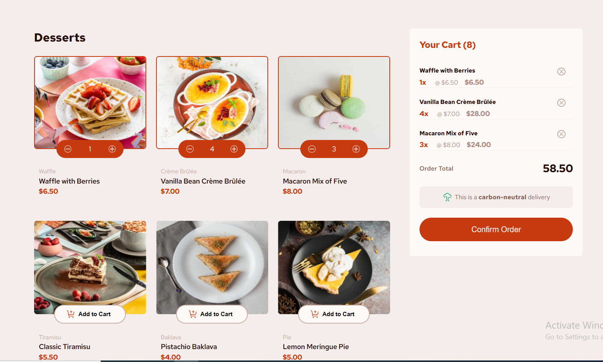

# Frontend Mentor - Product list with cart solution

This is a solution to the [Product list with cart challenge on Frontend Mentor](https://www.frontendmentor.io/challenges/product-list-with-cart-5MmqLVAp_d). Frontend Mentor challenges help you improve your coding skills by building realistic projects.

## Table of contents

- [Overview](#overview)
  - [The challenge](#the-challenge)
  - [Screenshot](#screenshot)
  - [Links](#links)
- [My process](#my-process)
  - [Built with](#built-with)
  - [What I learned](#what-i-learned)
  - [Continued development](#continued-development)
  - [Useful resources](#useful-resources)
- [Author](#author)
- [Acknowledgments](#acknowledgments)

**Note: Delete this note and update the table of contents based on what sections you keep.**

## Overview

### The challenge

Users should be able to:

- Add items to the cart and remove them
- Increase/decrease the number of items in the cart
- See an order confirmation modal when they click "Confirm Order"
- Reset their selections when they click "Start New Order"
- View the optimal layout for the interface depending on their device's screen size
- See hover and focus states for all interactive elements on the page

### Screenshot



Add a screenshot of your solution. The easiest way to do this is to use Firefox to view your project, right-click the page and select "Take a Screenshot". You can choose either a full-height screenshot or a cropped one based on how long the page is. If it's very long, it might be best to crop it.

Alternatively, you can use a tool like [FireShot](https://getfireshot.com/) to take the screenshot. FireShot has a free option, so you don't need to purchase it.

Then crop/optimize/edit your image however you like, add it to your project, and update the file path in the image above.

**Note: Delete this note and the paragraphs above when you add your screenshot. If you prefer not to add a screenshot, feel free to remove this entire section.**

### Links

- Solution URL: [Github source code](https://github.com/Drslope-99/product-list-with-cart-main)
- Live Site URL: [life site on vercel](https://product-list-with-cart-main-eta.vercel.app/)

## My process

### Built with

- Semantic HTML5 markup
- CSS custom properties
- Flexbox
- CSS Grid
- Pure vanilla javascript with no single framework

### What I learned

i familiarized my self a lot with javascript functions and also some advanced dom manipulations.
also really used the event object of the window eventlistener to target specifit buttons to update the UI also really perfected my css layout skills.

To see how you can add code snippets, see below:

```html
<h1>Some HTML code I'm proud of</h1>
```

```css
.order__overlay {
  display: none;
  justify-content: center;
  align-items: center;
  position: fixed;
  width: 100%;
  height: 100%;
  background-color: rgba(0, 0, 0, 0.6);
  top: 0;
  left: 0;
  z-index: 1000;
}
```

```js
function startNewOrder(prod) {
  const { products, cart } = prod;
  cart.length = 0;
  renderCart(cart);
  renderProducts(prod);
  orderModal.classList.remove("active");
}

startNewOrderBtn.addEventListener("click", (e) => startNewOrder(items));
```

If you want more help with writing markdown, we'd recommend checking out [The Markdown Guide](https://www.markdownguide.org/) to learn more.

### Continued development

I'll also work like to continuously improved the app is areas such as local storage where one can add items to the cart and if he/she mistakenly quits the page, the history will not be lost, maybe also transforming it into a MERN stack application in the nearest future.

### Useful resources

- [Example resource 1](https://www.example.com) - This helped me for XYZ reason. I really liked this pattern and will use it going forward.
- [Example resource 2](https://www.example.com) - This is an amazing article which helped me finally understand XYZ. I'd recommend it to anyone still learning this concept.

**Note: Delete this note and replace the list above with resources that helped you during the challenge. These could come in handy for anyone viewing your solution or for yourself when you look back on this project in the future.**

## Author

- Frontend Mentor - [@Drslope-99](https://www.frontendmentor.io/profile/Drslope-99)
- github - [@Drslopes](https://github.com/Drslope-99)

## Acknowledgments

I'll like to really appreciate my younger brother Ekomabasi for really giving me the motivation to push through this project and making sure i see it to completion. almost gave up at some point, but he told me and i quote "when something is important, you have to do it, even when the odds are not in your favour". A very special thanks to the team at front end mentor for making some of this advanced design projects available to us, so aspiring young developers can practice their front end skills
